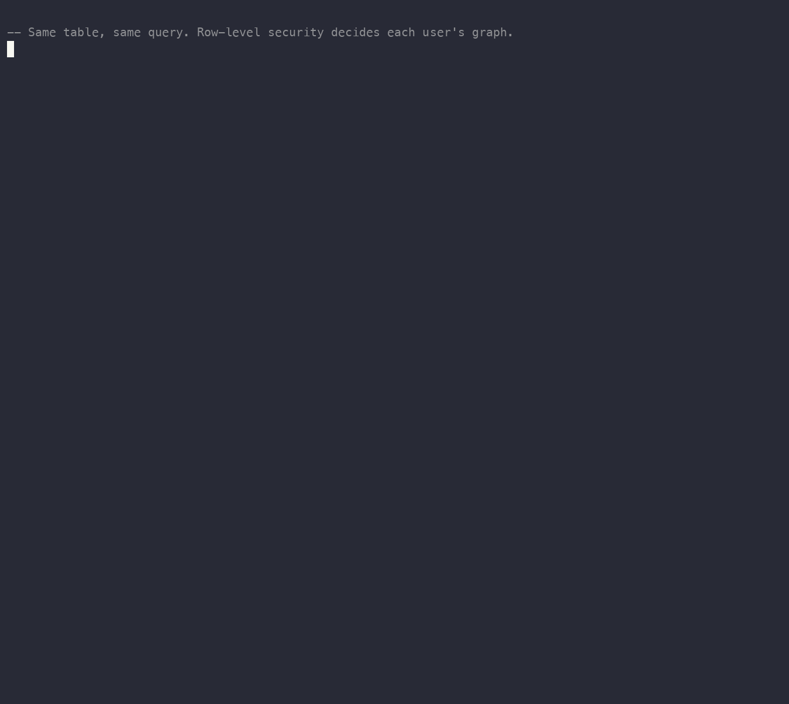

# pg_graphwright

[](https://github.com/hoofader/pg_graphwright/actions/workflows/ci.yml)

A knowledge graph that lives inside Postgres and inherits your row-level security. If a user cannot read the row, they cannot see the fact derived from it.

pg_graphwright builds an entity graph (people, places, things, and the links between them) from the documents in your tables and keeps it as Postgres-managed state. The position no other system takes: **a graph element's visibility follows the row-level security of its source rows.** There is no second access-control system to keep in sync with your data. For multi-tenant apps that already use Postgres RLS and want an entity graph over their documents, that means no second database and no second permission model.

(`graphwright`, as in a wheelwright: a maker of graphs.)



Same table, same query, two users, two different graphs. The row-level security you already wrote decides what each one contains. This is the [diary example](examples/diary/) running.

This is the Postgres-native sibling of [graphwright](https://github.com/hoofader/graphwright) (the storage-agnostic TypeScript core) and [graphwright-onnx](https://github.com/hoofader/graphwright-onnx) (the no-LLM extraction backend). The planning logic lives there; this repo is where it becomes an index.

## Try it

Requires superuser on a self-managed Postgres (it ships an index access method and a background worker, so managed services like RDS or Cloud SQL will reject `CREATE EXTENSION` until it is allow-listed).

```sql
CREATE EXTENSION pg_graphwright;

-- A table of documents behind an RLS policy.
CREATE TABLE notes (id int PRIMARY KEY, owner text, body text);
ALTER TABLE notes ENABLE ROW LEVEL SECURITY;
CREATE POLICY owner_can_read ON notes USING (owner = current_user);

INSERT INTO notes VALUES
  (1, 'amir', 'Sara Tehran'),
  (2, 'nadia', 'Sara Berlin');

-- Build the knowledge-graph index over the body column.
CREATE INDEX notes_kg ON notes USING graphwright (body);

-- Extraction and resolution run off the write path, so the graph is empty
-- until a maintenance tick (or the background worker) runs.
SELECT graphwright.maintain();

-- amir and nadia run the same query and get different graphs.
SET ROLE amir;  SELECT * FROM graphwright.edges('notes');   -- Sara -- Tehran
RESET ROLE;
SET ROLE nadia; SELECT * FROM graphwright.edges('notes');   -- Sara -- Berlin
```

Runnable demos are in [`examples/`](examples/): a complete [diary application](examples/diary/) (the end-to-end use case), plus single-feature demos for row-level-security-derived visibility, `union` vs `intersection` edge disclosure, and cross-script resolution with reversible review.

## Why not just...

- **A graph database (Neo4j, etc.)?** It owns the data and the access control. You then run two systems and two copies of "who can see what," and they drift. Here the graph lives in Postgres and there is one ACL: your existing RLS.
- **`pgvector` / a vector search?** Different job. That finds similar text. This builds an entity graph (people, places, the links between them) and resolves `Sara`/`Sarah`/`سارا` to one identity, with a human able to overrule a merge after the fact.
- **Doing it by hand?** The hard parts are the ones that are easy to get wrong: an edge backed by N rows with N different ACLs, cross-script identity resolution, and a reversible decision log. That is the extension.

## How the visibility is enforced

The catalog tables carry their own row-level security. A `SECURITY INVOKER` function `graphwright._pk_visible(watch_id, source_pk)` runs an `EXISTS` against the source table, so the source's RLS decides as the calling user. The `entity`/`mention`/`edge`/`entity_phonetic`/`decision`/`mention_override` policies build on it. A direct `SELECT * FROM graphwright.entity` is filtered the same as the accessor, so the accessor is no privileged back door:

```sql
SET ROLE analyst_without_access;
SELECT count(*) FROM graphwright.entity;   -- only entities from rows analyst can read
```

Two things worth being precise about:

- **Names are union-visible.** An entity (a name) is visible when at least one mention's source row is readable. The `union`/`intersection` rule below governs *edge* disclosure, not whether a name appears: a single readable row already justifies the name to that user.
- **The accessors are the hot path.** `entities`/`edges`/`mentions` join the source table once. A direct catalog read is filtered identically but probes visibility per row, so treat it as an audit and proof path, not a query you run in a loop.

Maintenance runs as the extension owner (which bypasses RLS, so the graph is built over every row). The maintenance and review functions (`maintain`, `reindex`, `gc`, `watch`, `merge`/`split`/`unmerge`, `split_mention`/`unsplit_mention`, `index_dump`) have `EXECUTE` revoked from `PUBLIC`; grant those to your operator and reviewer roles. The owner must be able to read every source row (a superuser, a `BYPASSRLS` role, or the table owner) for extraction to be complete.

## Edge visibility

An edge can be supported by more than one source row. Two rules, set per watch (default `union`):

- **`union`**: the edge is visible if the user can read any one supporting row. Safe for directly-extracted edges, because a single row already justifies the fact to that user.
- **`intersection`**: the edge is visible only if the user can read every supporting row.

```sql
UPDATE graphwright.watch SET visibility = 'intersection'
  WHERE source_table = 'notes'::regclass;
```

## How it works

`CREATE INDEX ... USING graphwright (body)` stores each row's extraction in the **index relation's own pages**, WAL-logged through generic WAL (the same approach as pg_search). It is transactional with the heap and travels with physical replication. `aminsert` writes only a small marker on a write, and `CREATE INDEX` itself only marks rows. The extractor, the judge, and the resolved cross-row graph build on the next `graphwright.maintain()` (or background-worker) tick, which runs as the extension owner so it sees every row. A slow model never blocks a write. `ambulkdelete` reclaims a deleted row's records on vacuum.

The cross-row resolved graph (entities and edges) is derived from that index storage into catalog tables that carry row-level security, so a graph row is visible exactly when the source rows behind it are. See [Resolution](#resolution) for how surfaces fold into entities.

## Live maintenance

Writes update index storage immediately (`aminsert`, in the writing transaction). The resolved graph is refreshed from that storage by `maintain()`:

```sql
SELECT graphwright.maintain();   -- re-resolve every graphwright index (e.g. from pg_cron)
```

For a worker that runs it automatically, preload the library and name the database:

```
# postgresql.conf
shared_preload_libraries = 'pg_graphwright'
graphwright.database = 'mydb'
```

Splitting the synchronous storage write from the async resolve is deliberate: extraction is a fast stub today, but when it becomes LLM-backed, the per-row tokens are still captured transactionally while the expensive resolution stays off the writing transaction.

There is also a no-index path (`graphwright.watch(table, text_col, pk_col)` + `graphwright.reindex(id)`) that builds the graph straight from source rows, with a trigger-fed queue (`graphwright.process_dirty(id)`) for incremental updates. Use it when you want the graph without `CREATE INDEX`, with a primary-key column as provenance instead of `ctid`.

## Extraction

What counts as an entity is a pluggable extension point, so the extension stays model-agnostic (the way graphwright's core treats the LLM as injected). Point `graphwright.extractor` at a SQL function `f(text) -> text[]`; leave it empty for the built-in tokenizer.

```sql
-- a toy extractor: capitalized words are entities
CREATE FUNCTION caps(doc text) RETURNS text[] LANGUAGE sql AS $$
  SELECT array_agg(w) FROM regexp_split_to_table(doc, '\s+') AS w WHERE w ~ '^[A-Z]'
$$;
SET graphwright.extractor = 'caps';
```

The function can wrap anything: a regex NER, an LLM gateway over `pg_net`, or GLiNER through [graphwright-onnx](https://github.com/hoofader/graphwright-onnx). For GLiNER, run its HTTP service and point the extension point at it with [`examples/gliner-extractor.sql`](examples/gliner-extractor.sql) (a `pgsql-http` function that POSTs the document and returns the surfaces). It runs asynchronously (the maintenance pass), so a slow model is fine; a write only records a marker. A failing extractor warns and is treated as no surfaces for that row, so a misconfiguration is visible rather than silent.

A second extension point validates the result. `graphwright.judge` names a function `j(text, text[]) -> text[]` (a larger model) that trims or vets the extractor's mentions before they reach the graph:

```sql
CREATE FUNCTION vet(doc text, mentions text[]) RETURNS text[] LANGUAGE sql AS $$
  SELECT array_agg(m) FROM unnest(mentions) AS m WHERE m <> 'secret'
$$;
SET graphwright.judge = 'vet';
```

This is the "AI output is never canon" step: the small model proposes mentions, the larger model disposes. A judge error or NULL leaves the extractor's output unchanged.

### Typed edges

By default an edge means co-mention: two names appeared in the same row, undirected. Point `graphwright.relation_extractor` at a SQL function `f(text) -> text[]` that returns flattened `(subject, predicate, object)` triples, and edges become directed and typed instead.

```sql
-- a toy relation extractor: "X manages Y" -> (X, manages, Y)
CREATE FUNCTION rels(doc text) RETURNS text[] LANGUAGE sql AS $$
  SELECT array_agg(part ORDER BY ord, idx)
  FROM (SELECT row_number() OVER () AS ord, m
        FROM regexp_matches(doc, '([[:upper:]]\w+) (manages|closed) ([[:upper:]]\w+)', 'g') AS m) t,
       LATERAL unnest(ARRAY[m[1], m[2], m[3]]) WITH ORDINALITY AS u(part, idx)
$$;
SET graphwright.relation_extractor = 'rels';
```

Endpoints resolve to entities the same way surfaces do, so only relations between extracted entities become edges, and `merge`/`split` still apply to them. A real deployment points this at an LLM or a relation model. See [`examples/typed-edges.sql`](examples/typed-edges.sql).

## Resolution

A mention's surface resolves to an entity by **exact match on a normalized key** (ported from the graphwright core): NFKC, then Arabic vs Persian yeh/kaf, alef variants, diacritics, tatweel, ZWNJ joins, case, and surrounding punctuation all fold, so `علي` and `علی` are one entity, and `Ｒｅｚａ` is `reza`.

Beyond exact, two lanes auto-merge when the name is distinctive enough (an entropy gate). A **cross-script phonetic match** (Latin, Persian, Cyrillic schemes): `Khashayar` and `خشایار` become one entity, as do `Khabarov` and `Хабаров`. A **3-gram fuzzy match** (Jaccard >= 0.82): a consonant typo forks the phonetic skeleton but barely moves the shingle overlap, so this catches spellings phonetic misses. Short names like `Ali` / `علی` stay apart and show up as proposals:

```sql
SELECT * FROM graphwright.proposals('notes');  -- gated-out candidates to review
```

When `graphwright.embedder` (a `f(text) -> float8[]` extension point) is set, an **embedding match** auto-merges names whose vectors clear `graphwright.embedding_threshold` (default `0.83`). This is the semantic lane: it reaches short names the entropy gate keeps out of the lexical lanes, so `Ali` / `علی` can merge on meaning.

### Reviewing decisions

Nothing waits for a human. Every identity decision is replayed from a durable log on each re-resolve, and you correct it after the fact, SAGA-style:

```sql
SELECT graphwright.split('notes', 'Khashayar', 'خشایار');  -- veto an auto-merge
SELECT graphwright.merge('notes', 'Ali', 'علی');           -- force a merge
SELECT graphwright.unmerge('notes', 'Ali', 'علی');         -- drop the decision
SELECT * FROM graphwright.decisions('notes');              -- the audit log
```

Every merge is reversible, including an exact fold of two identical spellings (two people both written `Sara`). Find the occurrence and pin it to its own entity:

```sql
SELECT entity_id, source_pk, surface_form FROM graphwright.mentions('notes');
SELECT graphwright.split_mention('notes', '(0,2)', 'Sara');    -- separate one occurrence
SELECT graphwright.unsplit_mention('notes', '(0,2)', 'Sara');  -- fold it back
```

Each applies immediately and is reversible: edit or delete the underlying row and the graph re-derives without it.

## Status

Early preview. The storage model is the Postgres-native one and the row-derived visibility is real and tested. Extraction defaults to a built-in tokenizer; the LLM/GLiNER lane is a pluggable extension point. The resolution cascade, the reversible decision log, and the RLS enforcement work and are covered by `cargo pgrx test`.

0.x has no in-place upgrade path: the catalog schema may change between previews, so drop and recreate the extension rather than `ALTER EXTENSION ... UPDATE`. A versioned upgrade story comes before the first release you are expected to keep.

## Build

```bash
cargo pgrx run pg17           # build, install, open a psql
cargo pgrx test pg17          # run the regression tests
./scripts/smoke-bgworker.sh   # end-to-end check of the background worker
```

Requires the pgrx toolchain (`cargo install cargo-pgrx`, then `cargo pgrx init`). Built against `pgrx 0.18`. CI runs the suite on PG15 and PG18; the extension is built with pgrx for PG13 through PG18. The background worker needs `shared_preload_libraries` and a restart, so it cannot run in `cargo pgrx test`; `scripts/smoke-bgworker.sh` exercises it against a throwaway cluster instead.

## License

MIT. See [LICENSE](LICENSE).
