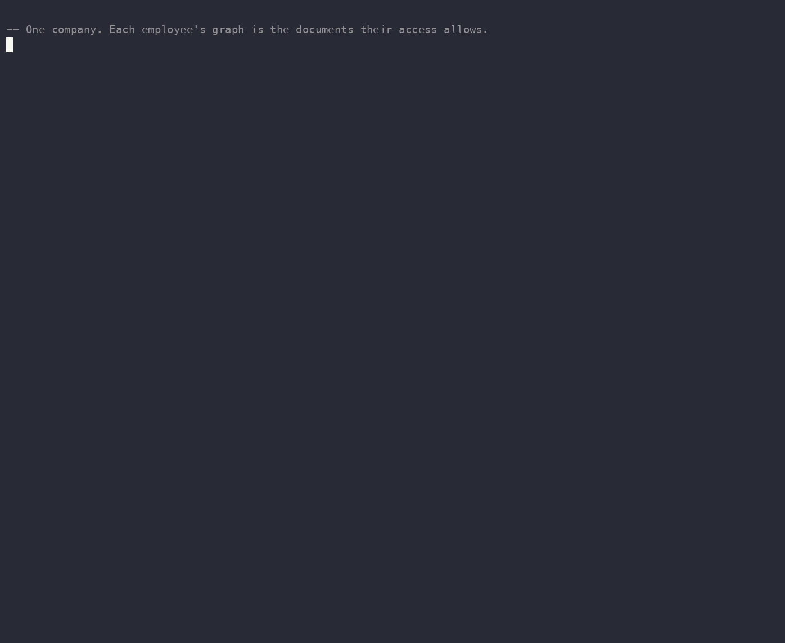

# Enterprise: per-employee knowledge graphs from document access

A worked example of the multi-tenant case: one company, three teams, and a
shared document store where every employee's knowledge graph is exactly the
documents they are allowed to read. It is the same idea as the diary example,
scaled from one-owner-per-row to real role-based access with sharing.



Joe shares one sales document with Kimi and it joins her graph; he unshares it
and it leaves, with no `graphwright.maintain()` in between.

```bash
psql -f examples/enterprise/schema.sql   # the reusable schema (run once)
psql -f examples/enterprise/demo.sql      # the walkthrough
```

Run `demo.sql` in a fresh session after `schema.sql`, so the database-level
extractor setting is in effect.

## The access rules

A document's team and owner decide who can read it, as one row-level-security
policy on the `docs` table:

- **engineering** docs: any member of the `engineering` role,
- **marketing** docs: everyone,
- **sales** docs: the owner only,
- plus any document explicitly shared with you (the `doc_shares` table).

The graph derived from the documents inherits all of it. There is no second
access model: the same policy that decides who can read a document decides
whose knowledge graph it appears in.

## What it shows

- **Five employees, five different graphs.** `kimi` and `ravi` (engineering)
  see both engineering docs and the public marketing doc. `joe` and `mia`
  (sales) each see only their own account plus marketing, never each other's
  deals. `dana` (marketing) sees the marketing doc alone. Each runs the same
  `SELECT who FROM my_people` and gets their own slice. No `WHERE` clause, no
  tenant column: `security_invoker` views let row security do the filtering.
- **Sharing changes a graph with no rebuild.** Joe shares the Globex account
  doc with Kimi. The Globex entities were always in the catalog (maintenance
  reads every row as the owner); the share only changes what Kimi's row
  security lets her read, so her graph picks up `Globex`, `Nadia`, and `Joe`
  immediately, with no `graphwright.maintain()` in between.
- **Unsharing removes it, also with no rebuild.** Joe deletes the share and
  the Globex doc leaves Kimi's graph on the next read. Visibility is computed
  live from the source policy, not baked into the graph.
- **No privileged back door.** A direct `SELECT count(*) FROM graphwright.entity`
  is filtered exactly like the views, so an employee cannot read around their
  access by querying the catalog.

## The mechanism (why no rebuild)

`graphwright.maintain()` builds the whole graph once, as the extension owner,
over every document. The catalog rows it writes carry row-level security: an
entity is visible to a caller when at least one document it came from is
readable by that caller. That readability check runs the `docs` policy as the
caller, live, on every read. So changing an ACL (a share, a role grant, an
ownership change) changes the graph a user sees on the very next query, with
no extraction and no re-resolution. The graph is derived state; visibility is
a view over it.

## The files

- `schema.sql`: the `docs` and `doc_shares` tables, the access policy, the
  extraction extension point (a toy `doc_names`), the `USING graphwright`
  index, and the `security_invoker` app views.
- `demo.sql`: creates the employees, writes the documents, builds the graph,
  walks each employee's view, then shares and unshares the Globex doc.

## Honest scope

Edges in this demo are co-mention (two names in the same document). For
directed, typed relationships (who reports to whom, who closed which deal),
point `graphwright.relation_extractor` at a relation function (see
`../typed-edges.sql`). Identity is resolved globally by name while visibility
is per employee, so two different people who share a name need
`graphwright.split_mention` to stay apart (see `../identity-resolution.sql`).
The toy capitals extractor is a stand-in for real NER through the extension
point (`../gliner-extractor.sql`). The share authorization here is deliberately
simple: a `doc_shares` policy lets you share only documents you own; a real
deployment would layer its own approval flow on top.
